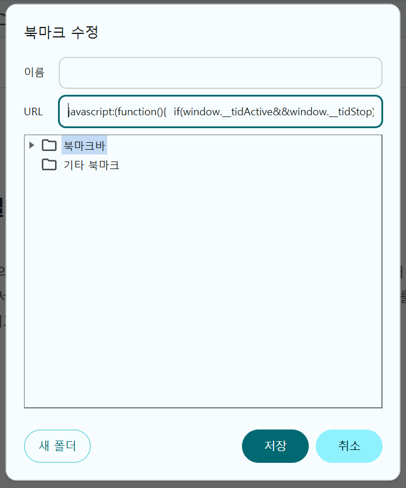
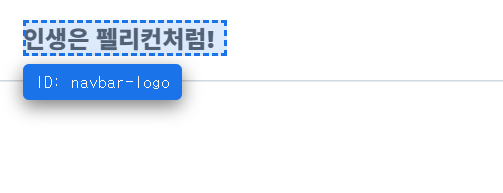

+++
title = "Claude Code 에게 '그 버튼' 을 지정해주는 방법"
date = 2026-05-27
draft = false
tags = ["claude-code", "frontend", "tooling", "workflow"]
+++

서버 개발자로 일하던 내가, Claude Code 를 본격적으로 사용하면서 프론트 작업과 풀스택 시스템 개발에까지 손을 대게 되었다. 그 과정에서 가장 자주 부딪힌 어려움이 이것이다.

"메인 페이지에서 검색 버튼 옆의 그 작은 X 버튼, 색을 좀 바꿔줘" — 이렇게 말하면 Claude 는 어느 파일의 어느 컴포넌트인지 알 길이 없다. 결국 내가 직접 위치를 찾아 알려주거나, Claude 가 한참 헤매다 엉뚱한 곳을 손대거나, 둘 중 하나다.

같은 일이 매번 반복되니 시간이 아까워 셋업을 정리했다. 거창하지 않은 변경이지만, 누적되는 효과는 작지 않다.

## 우선은 data-testid 컨벤션

방법 자체는 단순하다. 각 컴포넌트에 `data-testid="..."` 를 부여하고, Claude 에게는 그 testid 로 지시한다.

```html
<button data-testid="search-clear-btn">×</button>
```

이렇게 해두면 채팅 한 줄로 정리된다.

> "`data-testid="search-clear-btn"` 이 너무 크니 조금 줄여줘"

위치를 설명할 필요가 없고, 셀렉터로 헷갈릴 일도 없으며, Claude 도 한 번에 정확히 찾는다. e2e 테스트에서 어차피 testid 를 사용하므로 일석이조다.

## 그런데 컴포넌트가 100개라면 testid 도 100개

testid 를 할당하는 것 자체는 좋다. 다만 컴포넌트가 늘어나면 어디에 무엇이 추가되었는지 결국 잊어버린다. 이는 다시 코드를 확인해야 하는 번거로움으로 이어지고, 그 순간 처음의 문제로 되돌아간다. "어디에 뭐가 있더라" → 코드 검색 → 다시 시간 손실.

원하는 것은 단순하다. 브라우저에서 그 컴포넌트를 보고 있는 상태에서, 마우스로 가리키기만 하면 testid 가 즉시 드러나는 것.

## 그래서 만든 북마클릿

화면을 보면서 컴포넌트에 마우스를 올리면 testid 가 표시되고, 클릭하면 `data-testid="..."` 가 클립보드에 복사된다. 종료는 ESC.

```javascript
javascript:(function(){if(window.__tidActive&&window.__tidStop){window.__tidStop();return}window.__tidActive=true;var ov=document.createElement('div');Object.assign(ov.style,{position:'fixed',pointerEvents:'none',zIndex:'2147483647',border:'2px dashed #1a73e8',background:'rgba(26,115,232,0.15)',boxSizing:'border-box',transition:'all 0.05s ease'});document.body.appendChild(ov);var tip=document.createElement('div');Object.assign(tip.style,{position:'fixed',zIndex:'2147483647',background:'#1a1a2e',color:'#fff',padding:'4px 8px',borderRadius:'4px',fontSize:'11px',fontFamily:'monospace',pointerEvents:'none',whiteSpace:'nowrap',boxShadow:'0 4px 12px rgba(0,0,0,0.5)'});document.body.appendChild(tip);var cur=null;function findTid(el){while(el&&el!==document.documentElement){if(el.getAttribute&&el.getAttribute('data-testid'))return el;el=el.parentElement}return null}function onMove(e){var el=e.target,found=findTid(el);cur=found||el;var r=cur.getBoundingClientRect();ov.style.top=r.top+'px';ov.style.left=r.left+'px';ov.style.width=r.width+'px';ov.style.height=r.height+'px';var tid=cur.getAttribute('data-testid');tip.textContent=tid?'ID: '+tid:'(data-testid 없음)';tip.style.background=tid?'#1a73e8':'#444';var tx=r.left,ty=r.top-24;if(ty<5)ty=r.bottom+5;if(tx+tip.offsetWidth>window.innerWidth)tx=window.innerWidth-tip.offsetWidth-5;tip.style.left=tx+'px';tip.style.top=ty+'px'}function copyText(s){try{var ta=document.createElement('textarea');ta.value=s;ta.style.position='fixed';ta.style.opacity='0';document.body.appendChild(ta);ta.focus();ta.select();var ok=document.execCommand('copy');document.body.removeChild(ta);return ok}catch(e){return false}}function onClick(e){e.preventDefault();e.stopPropagation();var tid=cur&&cur.getAttribute('data-testid');var stopNow=function(){try{window.__tidStop&&window.__tidStop()}catch(e){}};if(!tid){showToast('❌ data-testid 없음');stopNow();return}var s='data-testid="'+tid+'"';var done=function(ok){showToast((ok?'✓ 복사됨: ':'⚠ 복사실패(수동복사): ')+s);stopNow()};if(navigator.clipboard&&window.isSecureContext){navigator.clipboard.writeText(s).then(function(){done(true)},function(){done(copyText(s))})}else{done(copyText(s))}}function onKey(e){if(e.key==='Escape')window.__tidStop()}function showToast(msg){var toast=document.createElement('div');toast.textContent=msg;Object.assign(toast.style,{position:'fixed',bottom:'20px',left:'50%',transform:'translateX(-50%)',background:'#059669',color:'#fff',padding:'10px 20px',borderRadius:'8px',fontSize:'13px',fontFamily:'monospace',zIndex:'2147483647',pointerEvents:'auto',userSelect:'text',maxWidth:'80vw',wordBreak:'break-all'});document.body.appendChild(toast);setTimeout(function(){toast.remove()},4000)}window.__tidStop=function(){document.removeEventListener('mouseover',onMove,true);document.removeEventListener('click',onClick,true);document.removeEventListener('keydown',onKey,true);ov.remove();tip.remove();window.__tidActive=false;window.__tidStop=null};document.addEventListener('mouseover',onMove,true);document.addEventListener('click',onClick,true);document.addEventListener('keydown',onKey,true);showToast('🚀 TestID Picker ON')})();
```

설치는 단순하다. 브라우저에서 새 북마크를 만들고, URL 칸에 위 코드를 통째로(앞의 `javascript:` 포함) 붙여 넣은 뒤, 이름을 "TestID Picker" 정도로 지정한다.



사용 흐름은 다음과 같다.

1. 작업할 페이지를 띄워둔 상태에서 그 북마크를 클릭한다.
2. "TestID Picker ON" 토스트가 뜨면 활성화가 완료된다.
3. 마우스를 따라 파란 점선 박스가 움직이고, testid 가 부여된 요소에는 박스 위에 ID 가 표시된다.
4. 컴포넌트를 클릭하면 `data-testid="..."` 가 클립보드에 자동 복사된다.
5. ESC 로 종료한다. 이후 채팅에 그대로 붙여 넣고 지시한다.

호버 시 가장 가까운 `data-testid` 를 가진 부모를 찾아주기 때문에, 안쪽 텍스트나 아이콘을 정확히 가리킬 필요는 없다.



## 셋업 시 컨벤션

이 흐름이 효과를 보려면 testid 가 미리 부여되어 있어야 한다. 후행으로 추가하는 일은 늘 번거롭기 마련이므로, 프로젝트 시작 시점부터 다음 규칙을 둔다.

- **인터랙티브 요소**(버튼, 폼 입력, 링크): 예외 없이 testid 를 부여한다.
- **명명 규칙**: `영역-역할` 형식을 사용한다. 예를 들어 `navbar-search`, `cart-checkout-btn`.
- **컨테이너·카드**: 의미가 있는 것에만 부여한다. 모든 요소에 붙이면 도리어 노이즈가 된다.

shadcn/ui 와 같은 라이브러리 컴포넌트는 컴포넌트 자체에 testid 를 부여하기 어려운 경우가 있다. 이때는 wrapper div 한 겹을 두고 그곳에 부여한다.

## 정적 사이트는 런타임 주입으로 우회

지금 이 블로그(Hugo + Hextra 테마)와 같이 빌드 결과물에 testid 를 직접 부여하기 어려운 경우에는, 런타임 JS 로 자동 부여하는 방식이 대안이 된다. body 끝(또는 head 끝)에 작은 스크립트를 두고, DOMContentLoaded 시점에 셀렉터를 매핑해 testid 를 붙이는 방식이다.

이 블로그도 그렇게 했다. `layouts/_partials/custom/head-end.html` 에 스크립트 한 토막을 둔 것이 전부다. 페이지가 열리면 `navbar`, `sidebar`, `footer`, `post-title`, `heading-h2-...` 와 같은 testid 가 자동으로 부여된다. 지금 이 글 페이지에서 위 북마클릿을 그대로 실행해보면 곧장 동작한다.

## 마무리

새로운 발상은 아니다. testid 는 e2e 테스트에서 본래 쓰던 패턴이고, 북마클릿 역시 형식만 다를 뿐 흔히 보는 헬퍼다.

다만 Claude Code 와 페어 코딩한다는 맥락에서 보면, "어디" 를 1초 안에 해결할 수 있다는 점이 누적되어 의외로 큰 차이를 만든다. 새 프로젝트를 시작할 때 README 에 testid 컨벤션을 한 줄 적어두고, 북마클릿을 북마크 바에 상시로 두는 정도가 — 작지만 단단한 기본 셋업이라 부를 만하다.
