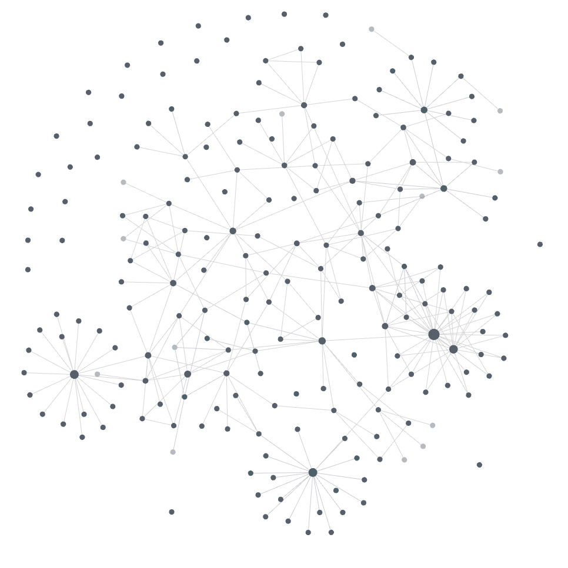

+++
title = "문서를 뉴럴 네트워크처럼: '제2의 뇌'를 직접 재 봤다"
date = 2026-06-16T00:00:00+09:00
draft = false
tags = ["knowledge-management", "second-brain", "zettelkasten", "networked-thought", "para"]
+++

Obsidian 의 그래프 뷰를 처음 켜 본 사람은 대개 같은 장면 앞에 멈춘다. 점 수백 개가 선으로 얽혀 천천히 진동하는, 발화하는 뇌의 단면 같은 그림. '제2의 뇌(second brain)' 를 파는 모든 글이 첫 화면으로 내거는 바로 그 스크린샷이다. 노트가 모이면 시냅스처럼 이어지고, 어느 순간 시스템이 나 대신 생각해 준다는 약속.

나도 그 약속을 믿고 1년 가까이 노트를 쌓았다. 그리고 1년 뒤의 내 그래프는 뇌처럼 보였지만 잡동사니 서랍처럼 동작했다. 점은 많은데 대부분 어디와도 닿지 않은 외딴 섬이었고, 정작 필요한 문서는 그래프가 아니라 전역 검색으로 찾고 있었다. '문서의 뉴럴 네트워크화' 라는 구호와, 실제로 손에 쥔 결과 사이에는 분명한 간극이 있었다.

그 간극이 궁금해서, 나는 이 담론을 코드로 구현해 보기로 했다. engram 이라는 이름의 문서 관리 도구이고, 해외 레퍼런스들이 주장하는 바를 규칙으로 옮긴 다음 **그 규칙을 내 뇌에 들이대 점수를 매기는 자(ruler)** 까지 붙였다. 그 자가 뱉은 숫자가 나를 머쓱하게 만들었고, 이 글은 그 숫자에서 시작한다.

## 그들이 파는 약속

이 분야의 원형은 독일 사회학자 Niklas Luhmann 이다. 그는 평생 약 9만 장의 색인 카드를 나무 상자에 모은 Zettelkasten(쪽지 상자) 으로, 70여 권의 책과 400편이 넘는 논문을 썼다. 핵심은 카드 수가 아니다. Luhmann 은 이 상자를 단순한 저장고가 아니라 '소통 상대(communication partner)' 라 불렀다. 그는 혼자 생각하지 않고 상자와 대화했으며, 양쪽 모두 상대가 무엇을 꺼낼지 몰랐기에 서로를 놀라게 할 수 있었다고 적었다. 검색이 아니라 연상(association) 이 지식을 만든다는 주장이다.

이 계보를 디지털로 끌어온 사람들이 오늘의 레퍼런스다. Andy Matuschak 은 '에버그린 노트(evergreen notes)' 라는 이름으로 세 가지 원칙을 못 박는다. 노트는 원자적(atomic) 이어야 하고, 개념 중심(concept-oriented) 이어야 하며, 빽빽하게 연결(densely linked) 되어야 한다. 그는 한 발 더 나아가 "위계적 분류(hierarchical taxonomy) 보다 연상적 구조(associative ontology) 를 택하라" 고 말한다. 그리고 가장 날 선 한 줄. "'더 나은 노트 필기' 는 핵심을 비껴간다. 중요한 건 '더 나은 사고' 다."

여기에 Tiago Forte 의 PARA(Projects·Areas·Resources·Archives) 분류법, Roam Research 가 대중화하고 Obsidian 이 표준으로 만든 양방향 링크와 백링크, Nick Milo 의 MOC(Map of Content) 가 더해진다. 표현은 제각각이지만 이들이 파는 명제는 하나로 수렴한다. **트리(폴더) 는 정보를 가두고, 그래프(링크) 는 생각하게 한다.** 인간의 기억은 위계가 아니라 연상으로 작동하니, 네 문서도 그렇게 만들라는 것.

## 왜 '뉴럴 네트워크' 는 절반만 맞는 비유인가

먼저 비유를 정직하게 해부하자. 그래프 뷰는 뉴럴 네트워크가 아니다. 가중치도, 학습도, 활성화 함수도 없다. 노드와 엣지가 전부인 정적 방향 그래프(directed graph) 일 뿐이다. 노트를 아무리 쌓아도 시스템이 역전파로 무언가를 배우지는 않는다. '발화하는 뇌' 같은 그 진동하는 그림은, 솔직히 말하면 눈요기에 가깝다. 실제로 이 도구들을 오래 쓴 실무자들조차 그래프 뷰는 예쁘지만 거의 쓸모없다고 입을 모은다.

그렇다면 무엇이 뇌를 닮았는가. 시각화가 아니라 **연상적 인출(associative retrieval)**, 즉 하나의 생각에 여러 경로로 도달할 수 있다는 성질이다. 폴더 트리에서 문서는 정확히 한 자리에 산다. '암호화/국내규격/KCMVP' 라는 경로 하나로만 닿는다. 반면 링크된 문서는 컴플라이언스 노트에서도, 양자내성 암호 메모에서도, 어제 적은 회의록에서도 닿는다. 인출 경로가 많을수록, 잊었던 맥락에서 그 문서가 다시 튀어나온다. Luhmann 이 말한 '놀라움' 의 정체가 이것이다.

정리하면 이렇다. 마케팅은 그래프 그림이고, 메커니즘은 다중 경로 인출이다. 그림은 공짜로 따라오지만, 인출 경로는 누군가 손으로 깔아야 생긴다.

## 내 뇌를 자로 재 봤다

대부분의 노트 도구가 측정하는 건 딱 하나, **고아(orphan)** 다. 들어오는 링크가 하나도 없는 문서. 그런데 고아가 없다는 건 '연결됨' 의 최저선일 뿐, 뇌를 닮았다는 증거가 못 된다. 그래서 engram 의 자에는 눈금을 하나 더 새겼다. **woven 비율** — 폴더의 MOC 가 아니라 *다른 본문 문서* 가 맥락으로 가리키는 노드의 비율. 그리고 **외로운 스포크(lonely spoke)** — 오직 자기 폴더 MOC 로만 닿는, 고아 검사는 통과하지만 실은 폴더 트리를 링크로 다시 그린 것뿐인 노드.

이 자를 1년 묵은 내 뇌에 들이댔다. 고아는 **0개**. 교과서 검사는 만점이다. 그런데 woven 비율은 **38%**, 외로운 스포크가 **88개**였다. 그래프 모양으로도 한눈에 드러났다. 큰 허브 대여섯 개에서 잎이 방사형으로 터져 나오는, 별(star) 들의 모임. 그물(mesh) 이 아니었다.

이게 '연결됐지만 엮이지 않은(connected but not woven)' 상태다. MOC 하나만 깔면 폴더의 모든 문서가 고아를 면한다. 그래서 린터는 만점을 주는데, 정작 인출 경로는 '자기 폴더' 단 하나뿐이다. 다중 경로 인출이라는 메커니즘이 아예 작동하지 않는다. 잘 정돈된 서랍을 링크 선으로 그려 놓고 뇌라 부르고 있었던 셈이다. 고아 검사는 바닥이지 목표가 아니다.

## 진짜 작동하는 것은 write-time 비용이다

별을 그물로 바꾸려면 손으로 링크를 깔아야 한다. 그 '손으로 깐다' 가 이 시스템의 본질이다. 링크는 읽을 때(read-time) 의 이득을 위해 쓸 때(write-time) 치르는 비용이다.

엔지니어에게 이건 낯선 구조가 아니다. 데이터베이스 인덱스와 정확히 같다. 인덱스를 걸면 INSERT 는 느려진다. 쓸 때마다 B-tree 를 갱신해야 하니까. 대신 SELECT 가 빨라진다. 지식 그래프의 링크도 똑같다. 노트 하나를 새로 쓸 때마다 "이게 기존의 무엇과 닿는가" 를 멈춰 서서 따지는 마찰이 인덱스 갱신 비용이고, 몇 달 뒤 잊었던 맥락에서 그 노트가 되살아나는 것이 인출 가속이다. 비용을 쓰기 시점에 선불로 내야 한다는 점이, 사람들이 링크를 자꾸 미루다 그래프를 별 모양으로 굳히는 이유이기도 하다.

원자적 노트(atomic note) 원칙도 이 비용 구조 위에서야 의미가 통한다. 노트를 작게 쪼개라는 건 미니멀리즘 취향이 아니다. **다른 곳에서 독립적으로 링크되기 위해** 작은 것이다. 그래서 원자성의 판단 기준은 길이가 아니라 한 줄짜리 질문이다. "이 개념을 다른 맥락에서 따로 링크하거나 재사용할 일이 있는가?" 그렇다면 독립 노트로 떼어 내고, 한 맥락에서만 쓰인다면 본문에 그냥 둔다. 모든 문장을 잘게 부수는 건 인덱스를 과하게 거는 것과 같아서, 유지 비용만 늘고 응집은 잃는다.

## 폴더는 거버넌스, 링크는 맥락

그러면 폴더는 버려야 하는가. Matuschak 이 위계보다 연상을 택하라 했으니, PARA 같은 분류는 구식인가. 내가 내린 결론은 정반대다. 폴더와 링크는 경쟁하는 두 방식이 아니라, **층위가 다른 두 시스템**이다.

폴더(물리적 분류) 는 거버넌스를 소유한다. 이 문서의 생애주기 — 누가 고치고, 언제 보관(archive) 하고, 끝났는지 — 를 책임진다. PARA 의 Projects 와 Archives 구분이 바로 이 생애주기 축이다. 링크(논리적 연결) 는 맥락을 소유한다. 폴더 경계를 가로질러 "이건 무엇과 관련되는가" 를 잇는다. engram 의 한 줄 요약이 이것이다. 물리적 분류 위에 논리적 링크 층을 한 겹 얹는다(Networked PARA).

실무에서 사고가 나는 지점은 둘 중 하나에게 다른 하나의 일을 시킬 때다. 폴더를 8단계로 깊게 파면, 분류가 링크가 해야 할 연결까지 떠안으려다 어디에도 안 맞는 문서를 양산한다. 반대로 링크만 믿고 분류를 포기하면, 끝난 프로젝트와 살아 있는 작업이 한 그래프에 뒤섞여 무엇을 보관해도 되는지 판단할 축이 사라진다. 폴더는 '어디 사는가/언제 은퇴하는가' 에, 링크는 '무엇과 닿는가' 에만 답하게 한다.

## 뉴럴화는 노드를 더하는 게 아니라 빼는 일이기도 했다

88개의 스포크를 엮으려고 후보를 뽑다가, 가장 뜻밖의 사실과 마주쳤다. 스포크의 **3분의 2 가까이가 애초에 brain 에 있어선 안 될 문서들**이었다. 지식이 아니라, 자체 외부 발행·납품 워크플로우를 가진 *산출물* 이었다. 이 블로그가 그 전형이다. 씨앗 → 드래프트 → 발행 → 정적 사이트 → SNS 라는 생애주기가 내 사고 네트워크 바깥에서 돈다. 그런 문서는 다른 지식과 맥락으로 닿을 일이 거의 없다 — 엮이지 않는 게 당연한, 출력물이니까.

여기서 결정적인 구분이 갈린다. 무언가가 분리되어야 하는 기준은 "결과물이냐" 가 아니라 **"자체 외부 생애주기를 갖느냐"** 다. 기획서나 설계 문서는 결과물처럼 보여도 brain 에 남는다. 그건 지식이 *적용되는* 자리, 즉 가장 가치 있는 노드다. 반면 발행물·납품물은 brain 밖 형제 폴더로 빼야 한다. 그래야 사고 네트워크가 출력물에 오염되지 않는다.

그래서 내 뇌의 woven 비율을 끌어올린 첫 수는 링크가 아니라 **삭제(정확히는 분리)** 였다. 출력물 무더기를 brain 밖으로 들어내자, 별 모양의 절반이 그냥 사라졌다. 뉴럴화의 절반은 잇는 일이고, 나머지 절반은 **애초에 그래프에 있을 자격이 없는 노드를 솎아 내는 일**이었다. 레퍼런스들은 "더 많이 연결하라" 고만 말하지, "무엇을 빼야 하는가" 는 거의 말하지 않는다.

## 정비공의 시선: 지식 그래프는 정합성 문제다

남은 진짜 지식을 엮는 단계에서, 레퍼런스들이 가장 적게 말하는 문제가 드러난다. 모든 '제2의 뇌' 는 조용히 썩는다.

실무자들이 스스로 이름 붙인 실패 모드가 둘 있다. 하나는 **수집가의 오류(collector's fallacy)** — 정보를 모으는 것을 안다고 착각하는 것. 다른 하나는 **과잉 구조화(over-structuring)** — 시스템을 유지하는 일 자체가 목적이 되어 정작 생각과 산출이 멈추는 것. 여기에 나는 순수하게 엔지니어링적인 세 번째를 더한다. **참조 정합성(referential integrity).** 지식 그래프는 결국 데이터베이스인데, 아무도 거기에 외래 키 검사를 돌리지 않는다. 고아 노드는 누구도 참조하지 않는 행이고, 깨진 링크는 댕글링 포인터다. 코드라면 컴파일러가 잡아 줄 문제를, 노트 시스템에서는 아무도 잡지 않는다.

그래서 engram 은 이걸 **린트(lint)** 로 다룬다. 가장 값싼 처방은 Nick Milo 의 MOC 다. 폴더마다 허브 노트(README) 하나로 그 폴더의 모든 문서를 링크하면 고아가 한 방에 해소된다. 다만 사람들이 거의 다 빠지는 함정이 하나 있다. MOC 항목을 백틱으로 적으면 안 된다는 것.

```text
# 허브 노트는 가득 차 보이지만, 모든 문서가 여전히 고아다
- `00-overview.md`   ← inline code: 린터가 걷어 내 0개 링크로 집계
- `01-threat-model.md`

# 이렇게 써야 실제 inbound link 로 집계된다
- [00-overview.md](00-overview.md)
- [01-threat-model.md](01-threat-model.md)
```

린터는 inline code 를 링크 집계에서 걷어 낸다. 그래서 README 가 색인처럼 가득 차 있어도, 백틱으로 적힌 파일명은 한 건도 링크로 세지 않는다. 멀쩡해 보이는 허브가 실은 아무것도 연결하지 않고 있는, 이 분야에서 가장 흔한 '조용한 정합성 사고' 다. 한 가지는 분명해졌다. 고아·깨진 링크 같은 정합성 검사는 규칙으로 환원되니 기계에 위임할 수 있지만, **무엇을 남기고 무엇이 진짜로 무엇과 닿는가** 의 판단은 사람 몫이라는 것. 억지로 이은 링크는 신호가 아니라 잡음이다. 좋은 도구는 전자의 유지 비용을 걷어 내, 사람이 후자에 집중하게 한다.

## 마무리

이 자와 규율로 내 뇌를 한 차례 손봤다. 출력물을 들어내고, 남은 지식을 폴더 경계 너머로 엮었다. woven 비율은 38%에서 70%를 넘겼고, 외로운 스포크는 88개에서 30여 개로 줄었다. 한 차례 손본 지금의 그래프는 이렇다.



방사형으로만 뻗던 별들의 가운데가 서로 손을 뻗어 그물을 이루기 시작했다. 중요한 건 이게 더 예쁜 시각화가 아니라 더 많은 인출 경로라는 점이다.

'문서의 뉴럴 네트워크화' 는 허황된 구호가 아니다. 여러 경로로 닿는 지식은 실제로 한 자리에 박힌 지식보다 자주, 뜻밖의 순간에 되살아난다. 다만 레퍼런스들은 시각화를 과대 포장하고, 유지보수와 솎아 내기를 과소 평가한다. 발화하는 뇌 같은 그래프 그림은 결과가 아니라 미끼다. 문서 더미가 뇌를 닮는 것은 뇌처럼 **보일 때**가 아니라, 모든 생각이 여러 방향에서 닿고 그 상태가 엔트로피 아래에서도 **유지될 때**다. 그래프는 공짜로 따라온다. 그걸 연결된 채로 지키는 일이, 그리고 거기 있어선 안 될 것을 들어내는 일이 진짜 작업이다.
